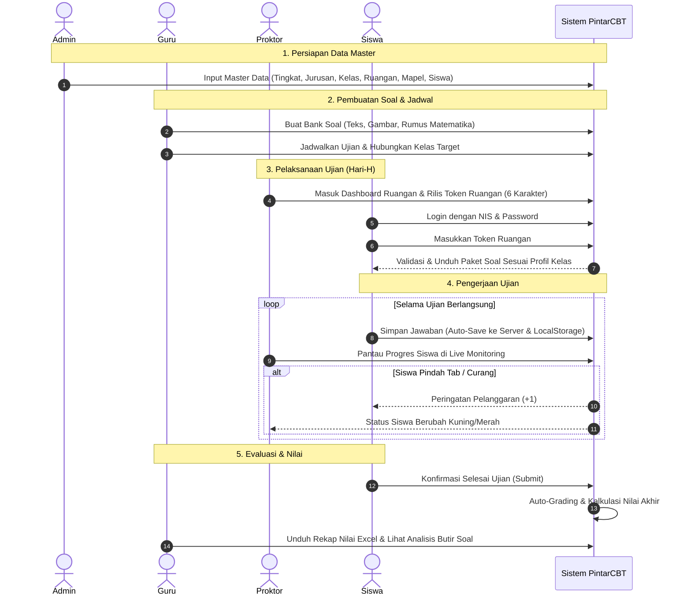

# PintarCBT (Smart Computer-Based Test)
> **Sistem Ujian Berbasis Komputer & Mobile (Hybrid Intranet/Internet)**  
> Dirancang untuk keandalan, fleksibilitas multi-jurusan, dan integritas ujian bebas kecurangan di lingkungan sekolah (SMK Banjar Asri).

---

## Daftar Isi
1. [Gambaran Umum](#gambaran-umum)
2. [Fitur Utama & Keunggulan](#fitur-utama--keunggulan)
3. [Arsitektur & Cara Kerja Sistem](#arsitektur--cara-kerja-sistem)
   - [Teknologi (Tech Stack)](#teknologi-tech-stack)
   - [Diagram Alur (Workflow)](#diagram-alur-workflow)
   - [Mekanisme Ketahanan Jaringan (Offline Tolerance)](#mekanisme-ketahanan-jaringan-offline-tolerance)
   - [Sistem Keamanan Anti-Curang (Anti-Cheating)](#sistem-keamanan-anti-curang-anti-cheating)
   - [Sistem Penilaian Otomatis (Scoring Formula)](#sistem-penilaian-otomatis-scoring-formula)
4. [Fitur Unggulan Terbaru](#fitur-unggulan-terbaru)
   - [A. Penulisan & Rendering Rumus Matematika (KaTeX / LaTeX)](#a-penulisan--rendering-rumus-matematika-katex--latex)
   - [B. Manajemen Jadwal Ujian Terstruktur (Per Tanggal & Sesi)](#b-manajemen-jadwal-ujian-terstruktur-per-tanggal--sesi)
   - [C. Ekspor & Backup Mandiri (Multi-Sheet Excel & Snapshot DB)](#c-ekspor--backup-mandiri-multi-sheet-excel--snapshot-db)
5. [Panduan Penggunaan yang Benar (SOP)](#panduan-penggunaan-yang-benar-sop)
   - [A. Panduan untuk Administrator](#a-panduan-untuk-administrator)
   - [B. Panduan untuk Guru](#b-panduan-untuk-guru)
   - [C. Panduan untuk Proktor (Pengawas Ruangan)](#c-panduan-untuk-proktor-pengawas-ruangan)
   - [D. Panduan untuk Siswa (Peserta Ujian)](#d-panduan-untuk-siswa-peserta-ujian)
6. [Manajemen Server & Operasional (DevOps)](#manajemen-server--operasional-devops)
   - [Status dan Perintah PM2](#status-dan-perintah-pm2)
   - [Auto-Start Saat Server Dinyalakan (Booting)](#auto-start-saat-server-dinyalakan-booting)
   - [Kesehatan & Konfigurasi Basis Data (SQLite WAL)](#kesehatan--konfigurasi-basis-data-sqlite-wal)
   - [Update Aplikasi & Rebuild](#update-aplikasi--rebuild)
   - [Backup Database](#backup-database)
7. [Daftar Akun Pengujian Default](#daftar-akun-pengujian-default)

---

## Gambaran Umum

**PintarCBT** adalah aplikasi evaluasi akademik modern yang dirancang untuk mengatasi tantangan operasional sekolah:
- **Fleksibel (Hybrid):** Berjalan optimal pada jaringan lokal/intranet sekolah (hemat kuota) maupun jaringan publik internet via Cloudflare Tunnel.
- **Dukungan Multi-Jurusan & Ruangan Campuran:** Siswa dari jurusan atau kelas yang berbeda dapat berada dalam satu ruangan laboratorium yang sama tanpa risiko tertukar soal.
- **Responsif & Ringan:** Antarmuka ramah pengguna di PC/Laptop, tablet, maupun smartphone siswa tanpa perlu instalasi aplikasi tambahan (berbasis web modern PWA).

---

## Fitur Utama & Keunggulan

* **Role-Based Access Control (RBAC):** Pemisahan hak akses yang ketat antara **Admin**, **Guru**, **Proktor**, dan **Siswa**.
* **Anti-Cheating Berlapis:**
  * Deteksi perpindahan tab browser (*tab switch*) dan kehilangan fokus (*window blur*).
  * Batas toleransi maksimal 3 kali peringatan pelanggaran sebelum sistem melakukan penyelesaian paksa (*auto-submit*).
  * Pemblokiran klik kanan, inspect element, seleksi teks, copy/paste, dan tombol pintasan keyboard.
  * Dukungan mode layar penuh (*Fullscreen Kiosk Mode*).
* **Pengacakan Ekstrem (Randomization):** Pengacakan urutan soal dan opsi jawaban berbasis *seed* unik per sesi pengerjaan siswa.
* **Resiliensi & Offline Tolerance:** Setiap jawaban siswa otomatis disimpan ganda ke penyimpanan lokal (*LocalStorage*) dan server; siswa tetap dapat menjawab soal saat koneksi terputus sesaat.
* **Live Monitoring Proktor:** Dashboard real-time untuk memantau status pengerjaan siswa per ruangan, jumlah jawaban terisi, serta kontrol darurat (*Reset Login*, *Force Submit*, dan *Hapus & Mulai Ulang*).
* **Koreksi Otomatis & Analisis Soal:** Penilaian instan untuk soal pilihan ganda, statistik tingkat kesukaran soal, serta ekspor rekapitulasi nilai ke format Microsoft Excel (.xlsx).

---

## Arsitektur & Cara Kerja Sistem

### Teknologi (Tech Stack)
* **Frontend & Backend:** Next.js (App Router, Server Actions, React 19)
* **Database & ORM:** SQLite via Better-SQLite3 & Prisma ORM (`dev.db` dengan mode WAL)
* **Styling & UI:** Tailwind CSS, Lucide React Icons, Tiptap Rich Text Editor
* **Math Formula Engine:** KaTeX (`katex`) untuk parsing dan perenderan LaTeX cepat & aman
* **Process Manager:** PM2 (Fork Mode dengan Systemd Auto-Start)
* **Web Server & Reverse Proxy:** Nginx (Port 80) dengan kompresi Gzip dan *static asset offloading*
* **Reverse Proxy / Tunnel:** Cloudflare Tunnel (`cloudflared`) mengarah ke domain resmi `upin.smkba.sch.id`

---

### Diagram Alur (Workflow)



---

### Mekanisme Ketahanan Jaringan (Offline Tolerance)

1. **Pemuatan Awal:** Saat siswa membuka lembar ujian, seluruh soal pada paket tersebut disimpan di memori peramban (*client-side memory*).
2. **Auto-Save Ganda:** Setiap kali siswa memilih jawaban, aplikasi:
   * Menyimpan ke `localStorage` perangkat.
   * Mengirim permintaan latar belakang ke server (`saveAnswer`).
3. **Koneksi Terputus:** Jika WiFi sekolah atau sinyal seluler putus:
   * Indikator status jaringan berubah menjadi **Offline** (kuning/merah).
   * Siswa tetap bisa membaca soal dan memilih jawaban yang disimpan ke antrean lokal.
4. **Auto-Sync:** Begitu koneksi pulih, sistem otomatis mengirimkan seluruh antrean jawaban tertunda ke database tanpa mengganggu pengerjaan siswa.

---

### Sistem Keamanan Anti-Curang (Anti-Cheating)

* **Fullscreen Enforcement:** Siswa diwajibkan mengaktifkan mode layar penuh untuk kenyamanan dan mencegah akses ke jendela lain.
* **Window Blur / Tab Switch Detection:** Setiap kali kursor keluar dari jendela ujian atau siswa beralih aplikasi, peringatan pelanggaran bertambah +1.
* **Auto-Submit Pelanggaran:** Sistem memiliki batas toleransi maksimal 3 kali pelanggaran. Pada pelanggaran ke-3, ujian otomatis dikunci dan diserahkan (*auto-submit*).
* **Pencegahan Pintasan & Seleksi:** Klik kanan, pintasan `Ctrl+C`, `Ctrl+V`, `F12`, `Ctrl+Shift+I` diblokir secara terpusat.

---

### Sistem Penilaian Otomatis (Scoring Formula)

Sistem menggunakan formula pembobotan persentase standar dengan skala **0 – 100** yang dibulatkan:

$$\text{Nilai Akhir} = \text{round}\left( \frac{\text{Total Bobot Benar}}{\text{Total Bobot Seluruh Soal}} \times 100 \right)$$

* **Bobot Bawaan (Default):** Setiap butir soal secara bawaan memiliki bobot **1**. Jika seluruh soal berbobot 1, maka:
  $$\text{Nilai} = \left( \frac{\text{Jumlah Benar}}{\text{Jumlah Soal}} \right) \times 100$$
* **Contoh Perhitungan (40 Soal Bobot 1):**
  * Benar 20 dari 40 soal $\rightarrow \mathbf{50}$
  * Benar 30 dari 40 soal $\rightarrow \mathbf{75}$
  * Benar 35 dari 40 soal $\rightarrow \mathbf{88}$ *(pembulatan)*
  * Benar 40 dari 40 soal $\rightarrow \mathbf{100}$
* **Dukungan Bobot Kustom:** Guru dapat menetapkan bobot berbeda pada nomor soal tertentu (misal: soal sukar berbobot 2 atau 3). Sistem secara otomatis menghitung nilai secara proporsional.
* **Tanpa Pengurangan Nilai (No Penalty):** Tidak ada sistem nilai minus untuk jawaban salah atau yang dikosongkan.

---

## Fitur Unggulan Terbaru

### A. Penulisan & Rendering Rumus Matematika (KaTeX / LaTeX)

PintarCBT kini mendukung perenderan rumus matematika tingkat lanjut berbasis **KaTeX**:
1. **Tombol "∑ Rumus" di Editor Soal:**
   - Tersedia di toolbar [RichTextEditor.tsx](src/app/components/RichTextEditor.tsx) pada menu **Tambah Soal** dan **Edit Soal**.
   - Dilengkapi modal palet cepat untuk berbagai simbol:
     - **Pecahan & Akar:** `\frac{a}{b}`, `\sqrt{x}`, `\sqrt[n]{x}`
     - **Pangkat & Indeks:** `x^{n}`, `x_{n}`, `x_{n}^{2}`
     - **Operasi & Relasi:** `\pm`, `\times`, `\div`, `\cdot`, `\leq`, `\geq`, `\neq`, `\approx`, `\infty`, `^\circ`
     - **Kalkulus & Aljabar:** `\int f(x) \, dx`, `\sum_{i=1}^{n} x_i`, `\lim_{x \to 0}`, matriks $2\times 2$, vektor `\vec{v}`
     - **Huruf Yunani:** $\alpha, \beta, \gamma, \theta, \pi, \Delta, \lambda, \omega$
     - **Trigonometri:** $\sin(x), \cos(x), \tan(x), \log(x), \ln(x)$
   - **Live Preview:** Tampilan rumus langsung muncul saat kode LaTeX diketik.
   - **Mode Format:** Pilihan *Inline* (`$rumus$`) untuk sebaris kalimat atau *Block* (`$$rumus$$`) untuk tampilan tengah tersendiri.
2. **Tombol Pratinjau Editor:** Tombol toggle `Pratinjau / Edit` langsung di toolbar editor untuk memeriksa tampilan akhir sebelum disimpan.
3. **Import Excel Mendukung Rumus:** Guru dapat menuliskan format `$rumus$` langsung di kolom Excel (Pertanyaan maupun Opsi A-E) saat mengimpor soal.
4. **Render Otomatis Presisi:** Rumus matematika otomatis dirender indah di layar siswa ([ExamClient.tsx](src/app/siswa/ujian/[jadwalId]/ExamClient.tsx)), detail bank soal, modal preview, dan halaman cetak A4.

---

### B. Manajemen Jadwal Ujian Terstruktur (Per Tanggal & Sesi)

Halaman Jadwal Ujian ([https://upin.smkba.sch.id/admin/jadwal](https://upin.smkba.sch.id/admin/jadwal)) telah diredesain sepenuhnya:
1. **Highlight Card "Jadwal Terdekat / Sedang Berlangsung":**
   - Menampilkan kartu prioritas di paling atas:
     - Badge berdenyut hijau `🔴 Sedang Berlangsung Sekarang` jika ada ujian aktif dengan tombol pintas `Pantau Ujian Sekarang ->`.
     - Badge `⚡ Jadwal Ujian Terdekat Berikutnya` jika ujian belum dimulai, menampilkan waktu mulai dan durasi.
2. **Pengelompokan Otomatis per Tanggal (Date Grouping):**
   - Jadwal ujian dikelompokkan rapi per hari pelaksanaan (contoh: `📅 Senin, 21 September 2026`).
   - Masing-masing tanggal dilengkapi penanda `🌟 HARI INI`, total jadwal, dan tombol buka/tutup (*collapse/expand*).
3. **Pengurutan Kronologis & Penomoran Sesi:**
   - Jadwal diurutkan maju berdasarkan jam mulai (`waktuMulai asc`) sehingga sesi pagi (07.30) berada di atas sesi siang.
   - Diberi penanda sesi otomatis: **Sesi 1**, **Sesi 2**, **Sesi 3** lengkap dengan jam WIB dan durasi menit.
4. **Pencarian Real-Time & Tab Filter Status:**
   - Filter instan: *Semua*, *Hari Ini*, *Sedang Berjalan*, *Akan Datang*, *Selesai*.
   - Pencarian berdasarkan nama ujian, mapel, atau kelas peserta.
   - Dropdown pilih tanggal spesifik dan tombol pintas "Lihat Hari Ini".
5. **Mode Tampilan Ganda (View Switcher):**
   - Pilihan antara **Mode Per Tanggal** (kartu timeline) atau **Mode Tabel** (*compact table*).

---

### C. Ekspor & Backup Mandiri (Multi-Sheet Excel & Snapshot DB)

Setiap jadwal ujian kini dilengkapi tombol **Backup**:
* **Rekap Hasil (.xlsx):** Mengunduh berkas Microsoft Excel *multi-sheet* berisi rekapitulasi nilai lengkap seluruh siswa beserta rincian jawaban per butir soal.
* **Snapshot Database (.db):** Sinkronisasi instan WAL SQLite dan pengunduhan berkas database murni untuk arsip sekolah.

---

## Panduan Penggunaan yang Benar (SOP)

### A. Panduan untuk Administrator
1. **Persiapan Data Master:**
   - Masukkan data Tingkat, Jurusan, Kelas, Ruangan, dan Mata Pelajaran di menu **Master Data**.
   - Unggah data siswa secara massal menggunakan template Excel yang disediakan.
2. **Kelola Jadwal & Kartu Peserta:**
   - Buka menu **Jadwal Ujian** untuk mengatur tanggal, jam, durasi, dan kelas peserta.
   - Buka menu **Kartu Ujian** untuk mencetak kartu peserta yang memuat QR Code login siswa.
3. **Backup Rutin:**
   - Lakukan backup database secara rutin melalui tombol backup di menu jadwal atau halaman pengaturan.

---

### B. Panduan untuk Guru
1. **Membuat Bank Soal:**
   - Masuk ke menu **Bank Soal > Tambah Bank Soal**.
   - Input butir soal dan opsi jawaban menggunakan **RichTextEditor**.
   - Untuk soal matematika, klik tombol **`∑ Rumus`** atau ketik langsung format `$rumus$`.
   - Gunakan tombol **Insert Image** jika soal membutuhkan gambar atau grafik.
   - Atau gunakan fitur **Import Excel** untuk memasukkan puluhan soal sekaligus.
2. **Melihat Nilai & Analisis:**
   - Setelah ujian selesai, buka menu **Nilai** untuk melihat rekapitulasi skor dan persentase ketercapaian soal.

---

### C. Panduan untuk Proktor (Pengawas Ruangan)
1. **Sebelum Ujian Dimulai:**
   - Masuk ke dashboard proktor (`/admin/proktor`) dan pilih ruangan yang diawasi.
   - Bagikan **Token Ruangan** (6 karakter) kepada siswa yang hadir.
2. **Saat Ujian Berlangsung:**
   - Pantau status pengerjaan siswa di layar monitor (*Belum Masuk*, *Sedang Mengerjakan*, *Selesai*).
   - Perhatikan indikator pelanggaran (kuning/merah).
   - Gunakan tombol **Reset Login** jika perangkat siswa mendadak mati/restart agar siswa dapat masuk kembali.
   - Gunakan tombol **Force Submit** jika siswa telah meninggalkan ruangan tanpa menyelesaikan ujian.

---

### D. Panduan untuk Siswa (Peserta Ujian)
1. **Persiapan Perangkat:**
   - Gunakan peramban Google Chrome terbaru pada PC/Laptop atau Smartphone.
   - Pastikan baterai minimal 50% dan terhubung ke jaringan ujian.
2. **Login & Token:**
   - Buka `https://upin.smkba.sch.id/login`.
   - Masukkan **NIS** dan **Password**.
   - Pilih jadwal ujian hari ini dan masukkan **Token Ruangan** dari Proktor.
3. **Aturan Pengerjaan:**
   - Aktifkan mode layar penuh (*Fullscreen*).
   - Pilih opsi jawaban A/B/C/D/E. Gunakan tombol **Ragu-Ragu** jika masih ragu.
   - Jawaban otomatis tersimpan ke server dan ke memori perangkat.
   - ❌ **Dilarang beralih tab atau membuka aplikasi lain!** Pelanggaran ke-3 akan mengunci dan menyelesaikan ujian secara otomatis.

---

## Manajemen Server & Operasional (DevOps)

### Status dan Perintah PM2

* **Memeriksa Status Server:**
  ```bash
  pm2 status
  ```
* **Melihat Log Aplikasi (Real-time):**
  ```bash
  pm2 logs pintarcbt
  ```
* **Restart Server:**
  ```bash
  pm2 restart pintarcbt
  ```
* **Reload Zero-Downtime:**
  ```bash
  pm2 reload pintarcbt
  ```

---

### Auto-Start Saat Server Dinyalakan (Booting)

Server telah dikonfigurasi auto-start via Systemd:
* `pm2-kami.service` (Node.js application)
* `cloudflared.service` (Cloudflare Tunnel)
* `nginx.service` (Reverse proxy port 80)

> [!IMPORTANT]
> Jalankan `pm2 save` setiap kali ada perubahan proses atau environment di PM2.

---

### Kesehatan & Konfigurasi Basis Data (SQLite WAL)

Aplikasi menggunakan engine SQLite berkecepatan tinggi dengan parameter optimal untuk ratusan siswa:
- **Journal Mode:** `WAL` (Write-Ahead Logging) — membaca dan menulis berjalan paralel tanpa saling blokir.
- **Busy Timeout:** `5000 ms` — mencegah galat *database locked*.
- **Synchronous:** `NORMAL (1)` — throughput penulisan maksimal dan aman.

---

### Update Aplikasi & Rebuild

Jika terdapat pembaruan kode pada server:
```bash
cd /home/kami/upin

# 1. Tarik pembaruan kode
git pull origin master

# 2. Pasang dependensi baru
npm install

# 3. Sinkronisasi skema database
npx prisma db push

# 4. Kompilasi production bundle
npm run build

# 5. Restart service
pm2 restart pintarcbt
```

---

### Backup Database

Lokasi basis data: `/home/kami/upin/dev.db`.
Lakukan pencadangan manual ke direktori backup:
```bash
cp /home/kami/upin/dev.db /home/kami/upin/backups/backup-cbt-$(date +%Y%m%d_%H%M%S).db
```

---

## Daftar Akun Pengujian Default

### 1. Akun Manajemen & Pengawas
| Peran | Username | Password | Keterangan |
| :--- | :--- | :--- | :--- |
| **Admin Utama** | `kami` | `Ganteng8` | Akses penuh administrator sistem |
| **Admin Cadangan** | `admin` | `smkba2024` | Akses administrator sekolah |
| **Guru IPA A** | `bu.ipa.a` | `smkba2024` | Pembuat soal IPA Kelas TO |
| **Guru IPA B** | `bu.ipa.b` | `smkba2024` | Pembuat soal IPA Kelas TJKT |
| **Proktor Ruangan** | `pak.proktor` | `smkba2024` | Pengawas sesi & pengelola token |

### 2. Akun Siswa Peserta Ujian *(Password semua siswa: `siswa2024`)*
| NIS | Nama Siswa | Kelas | Ruangan Ujian |
| :--- | :--- | :--- | :--- |
| `1001` | Agus | X TO1 | Ruang 1 |
| `1002` | Budi | X TO1 | Ruang 1 |
| `1003` | Citra | X TO1 | Ruang 2 |
| `2001` | Eko | X TO2/TJKT1 | Ruang 2 |
| `3001` | Indra | X TJKT2/TAV | Ruang 3 |
| `3003` | Kartika | X TJKT2/TAV | Ruang 4 |

---

*Dokumentasi Resmi Sistem Ujian Pintar (UPIN-SMKBA) — Diperbarui 16 September 2026.*
