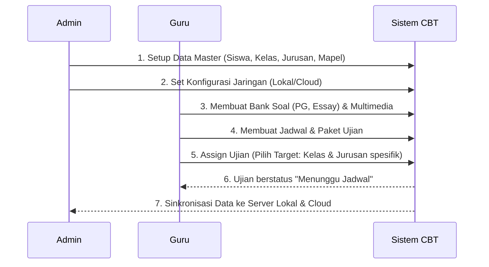
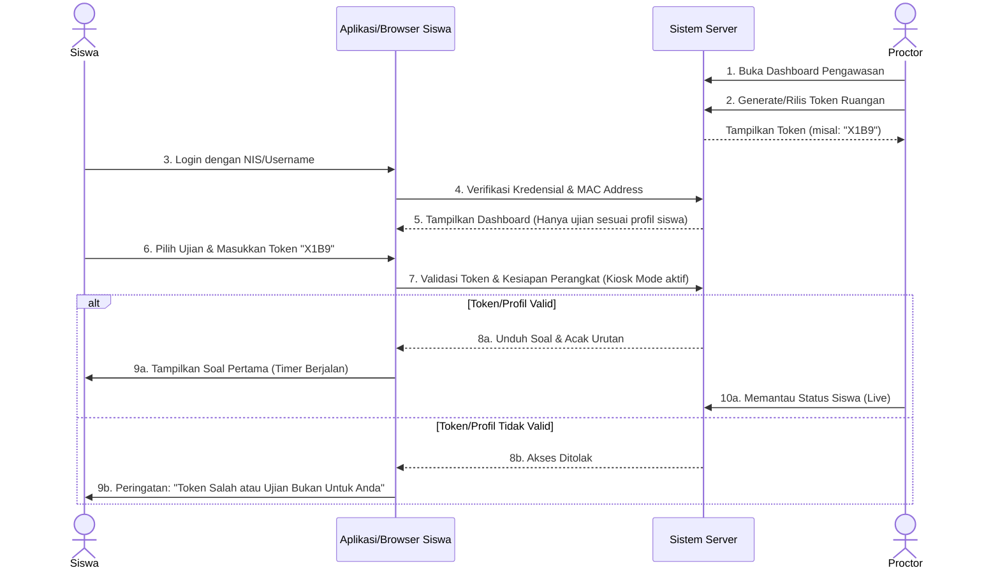
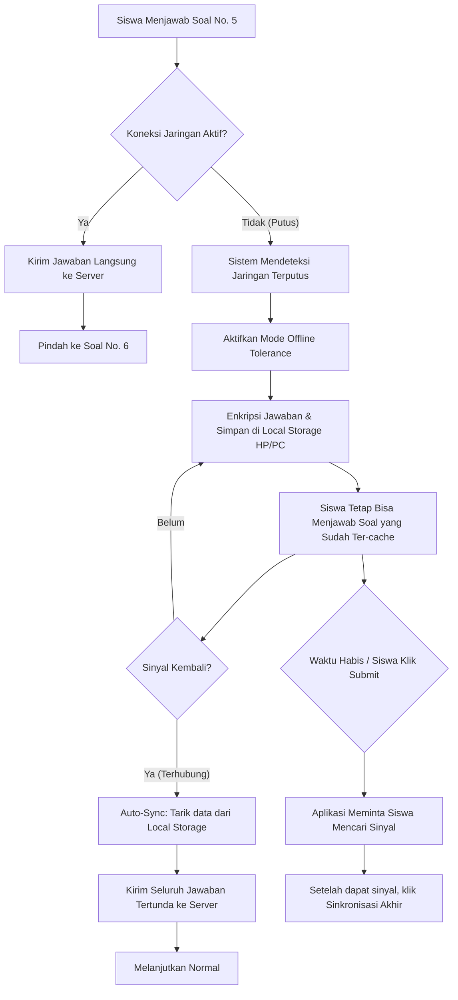
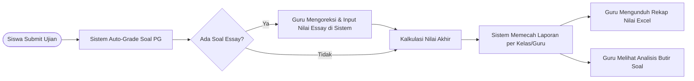

# Alur Kerja Sistem Ujian Pintar (Workflow)

Berikut adalah visualisasi alur (flow) cara kerja sistem ujian dari awal persiapan hingga penanganan ketika terjadi gangguan jaringan.

---

## 1. Alur Persiapan Ujian (Admin & Guru)
Alur ini menjelaskan bagaimana sebuah ujian disiapkan sebelum siswa bisa mengaksesnya.

---

## 2. Alur Pelaksanaan Ujian (Proctor & Siswa)
Alur ini terjadi pada hari-H ujian di dalam ruangan (fisik maupun virtual).

---

## 3. Alur Penanganan Putus Jaringan (Offline Tolerance)
Ini adalah alur di belakang layar saat perangkat siswa kehilangan sinyal internet/intranet saat sedang ujian.

---

## 4. Alur Evaluasi dan Rekapitulasi (Pasca Ujian)
Bagaimana nilai diproses setelah semua siswa selesai.

